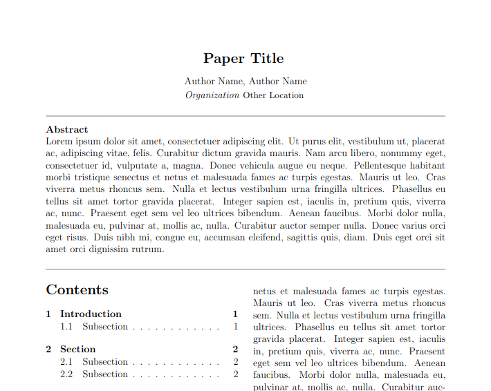

# BSF LaTeX Template

Welcome to the BSF LaTeX template for reports! This template is designed to help you create professional-looking academic papers, technical reports, and other types of documents that require a pretty two-column layout. The template is based on the popular LaTeX document preparation system and uses simple packages, making it highly customizable for other needs. The template is highly customizable, and you can easily modify it to fit your specific needs. Whether you're a student, researcher, or professional, this template will save you time and help you produce high-quality documents.

This LaTeX template is released under the Creative Commons Attribution 4.0 International (CC BY-SA 4.0) license, which means that you are free to use, modify, and distribute the template as long as you give attribution to the original author and share your changes under the same license. If you have any suggestions or contributions to improve the template, please feel free to submit them directly on Github. Your feedback is greatly appreciated, and it will help make the template even more useful for others. Thank you for using this template, and we hope that it helps you in your academic and professional endeavors.
